# Дипломная работа
## Деплой приложения в кластер Kubernetes в Яндекс.Облаке

---

## Общее описание
Задача состоит в том, что требуется:
1. Создать инфраструктуру в Яндекс.Облаке;
2. Установить на неё кластер Kubernetes;
3. Установить систему мониторинга (Prometheus+Grafana+NodeExporter+AlertManager);
4. Создать реестр для хранения образов приложения;
5. Настроить автоматический деплой приложения в кластер при изменениях прилдожения в репозитории

Для решения этих задач решено использовать следующие инструменты:
- Terraform для создания инфраструктуры;
- Ansible для настройки узлов, установки кластера Kubernetes и установки мониторинга в кластер
- GitLab для автоматизации деплоя приложения

Для автоматизации самого процесса создания указанной инфраструктуры принято решения создать два скрипта на `bash`:
- [`deploy.sh`](./deploy.sh) для создания инфраструктуры
- [`destroy.sh`](./destroy.sh) для уничтожения инфраструктуры

---
## ЭТАП I
## СОЗДАНИЕ ИНФРАСТРУКТУРЫ

### СОЗДАНИЕ БАКЕТА (папка `terraform_backet`)
По условиям задания следует хранить `backend` Терраформа в Бакете в облаке. То есть, рядом с остальной инфраструктурой. Единовременно создать с помощью Терраформа `Бакет` в `Облаке` и сразу же его использовать нельзя.  
Поэтому создано два отдельных каталога с конфигурациями Терраформ:
- `terraform_backet` для создания `Бакета`
- `terraform` для создания инфраструктуры

Создание Бакета не включено в скрипт [`deploy.sh`](./deploy.sh), поскольку после создания Бакета требуется настроить права для его использования.

Для уменьшения количества ручных действий создан скрипт [`create_backet.sh`](./create_backet.sh),
который запускает Терраформ для создания бакета, затем получает значения access_key и secret_key,
которые используются для создания файла `provider.tf` по шаблону ([`provider.j2`](terraform_backet/provider.j2)) для использования на следущем этапе.

### ВЫПОЛНЕНИЕ:
На начало работы в Яндекс Облаке отсутствуют ресурсы:
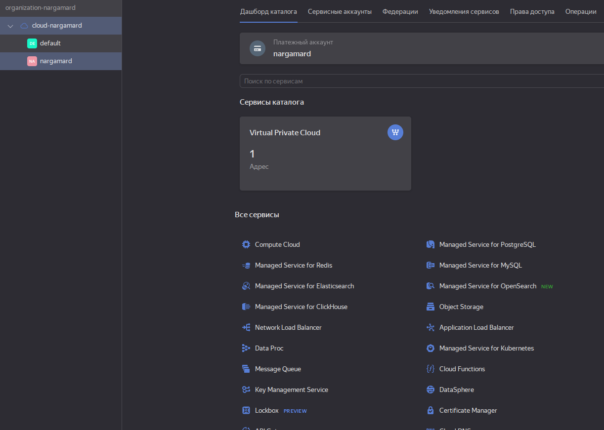

Запускаем скрипт создания бакета.
<details>
<summary>Вывод скрипта</summary>

```bash
[andrej@home-srv FinalWork]$ ./create_backet.sh 
 СОЗДАЁМ БАКЕТ В ЯНДЕКС ОБЛАКЕ
[    (0/2)] Создаём Бакет с помощью Terraform... 

Terraform used the selected providers to generate the following execution plan. Resource actions are indicated with the following symbols:
  + create

Terraform will perform the following actions:

  # yandex_iam_service_account.sa will be created
  + resource "yandex_iam_service_account" "sa" {
      + created_at = (known after apply)
      + folder_id  = (known after apply)
      + id         = (known after apply)
      + name       = "service-acc-backet"
    }

  # yandex_iam_service_account_static_access_key.sa-static-key will be created
  + resource "yandex_iam_service_account_static_access_key" "sa-static-key" {
      + access_key           = (known after apply)
      + created_at           = (known after apply)
      + description          = "static access key for object storage"
      + encrypted_secret_key = (known after apply)
      + id                   = (known after apply)
      + key_fingerprint      = (known after apply)
      + secret_key           = (sensitive value)
      + service_account_id   = (known after apply)
    }

  # yandex_resourcemanager_folder_iam_member.sa-editor will be created
  + resource "yandex_resourcemanager_folder_iam_member" "sa-editor" {
      + folder_id = "b1gbdtedb4koa56sb2rr"
      + id        = (known after apply)
      + member    = (known after apply)
      + role      = "storage.editor"
    }

  # yandex_storage_bucket.nargamard-netology-diplom will be created
  + resource "yandex_storage_bucket" "nargamard-netology-diplom" {
      + access_key            = (known after apply)
      + acl                   = (known after apply)
      + bucket                = "terraform-storage-nargamard"
      + bucket_domain_name    = (known after apply)
      + default_storage_class = (known after apply)
      + folder_id             = (known after apply)
      + force_destroy         = false
      + id                    = (known after apply)
      + secret_key            = (sensitive value)
      + website_domain        = (known after apply)
      + website_endpoint      = (known after apply)

      + anonymous_access_flags {
          + config_read = (known after apply)
          + list        = (known after apply)
          + read        = (known after apply)
        }

      + grant {
          + id          = (known after apply)
          + permissions = (known after apply)
          + type        = (known after apply)
          + uri         = (known after apply)
        }

      + versioning {
          + enabled = (known after apply)
        }
    }

Plan: 4 to add, 0 to change, 0 to destroy.

Changes to Outputs:
  + yandex_container_registry_access_key = (known after apply)
  + yandex_container_registry_secret_key = (sensitive value)
yandex_iam_service_account.sa: Creating...
yandex_iam_service_account.sa: Creation complete after 1s [id=aje0f9hftqo8nvs76hs7]
yandex_resourcemanager_folder_iam_member.sa-editor: Creating...
yandex_iam_service_account_static_access_key.sa-static-key: Creating...
yandex_iam_service_account_static_access_key.sa-static-key: Creation complete after 1s [id=aje6bro9eppg5kc64mgs]
yandex_storage_bucket.nargamard-netology-diplom: Creating...
yandex_resourcemanager_folder_iam_member.sa-editor: Creation complete after 2s [id=b1gbdtedb4koa56sb2rr/storage.editor/serviceAccount:aje0f9hftqo8nvs76hs7]
yandex_storage_bucket.nargamard-netology-diplom: Still creating... [10s elapsed]
yandex_storage_bucket.nargamard-netology-diplom: Still creating... [20s elapsed]
yandex_storage_bucket.nargamard-netology-diplom: Still creating... [30s elapsed]
yandex_storage_bucket.nargamard-netology-diplom: Still creating... [40s elapsed]
yandex_storage_bucket.nargamard-netology-diplom: Still creating... [50s elapsed]
yandex_storage_bucket.nargamard-netology-diplom: Still creating... [1m0s elapsed]
yandex_storage_bucket.nargamard-netology-diplom: Still creating... [1m10s elapsed]
yandex_storage_bucket.nargamard-netology-diplom: Still creating... [1m20s elapsed]
yandex_storage_bucket.nargamard-netology-diplom: Still creating... [1m30s elapsed]
yandex_storage_bucket.nargamard-netology-diplom: Still creating... [1m40s elapsed]
yandex_storage_bucket.nargamard-netology-diplom: Still creating... [1m50s elapsed]
yandex_storage_bucket.nargamard-netology-diplom: Still creating... [2m0s elapsed]
yandex_storage_bucket.nargamard-netology-diplom: Creation complete after 2m3s [id=terraform-storage-nargamard]

Apply complete! Resources: 4 added, 0 changed, 0 destroyed.

Outputs:

yandex_container_registry_access_key = "YCAJEUSZH8suOX5OHauL9wCw4"
yandex_container_registry_secret_key = <sensitive>
[##  (1/2)] Создаём файл provider.tf для дальнейшего использования бакета при создании инфраструктуры
 [####(2/9)] ЗАВЕРШЕНО
[andrej@home-srv FinalWork]$ 

```
</details>

Бакет создан:
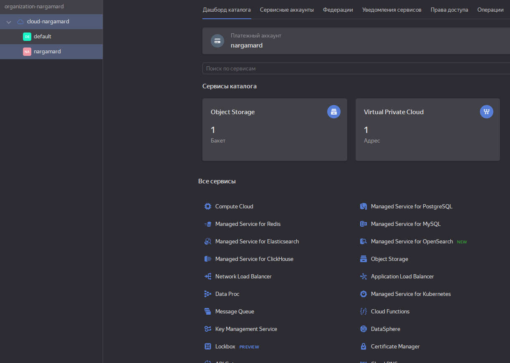

---

### СОЗДАНИЕ ВИРТУАЛЬНЫХ МАШИН, СЕТЕЙ, DNS (папка `terraform`)

Создаётся одна сеть и три подсети в разных зонах доступности ([`network.tf`](/terraform/network.tf)):
- ru-central1-a
- ru-central1-b
- ru-central1-c

Создаётся `yandex_dns_zone` и А-записи в ней ([`dns.tf`](/terraform/dns.tf)) для доступа по имени узлам и сервисам. Домен sarajkins.space был арендован заранее.

Создаётся реестр ([`registry.tf`](/terraform/registry.tf)) для хранения образов.
Создаются следующие виртуальные машины:
1. [`proxy.tf`](/terraform/proxy.tf) - единственная машина с внешним ip адресом для доступа через неё к остальной инфраструктуре;
2. [`master.tf`](/terraform/master.tf)- для настройки как `control-plane` кластера `Kubernetes`
3. [`worker01.tf`](/terraform/worker01.tf) - для настройки как `worker-node` кластера `Kubernetes`
4. [`worker02.tf`](/terraform/worker02.tf) - для настройки как `worker-node` кластера `Kubernetes`
5. [`gitlab.tf`](/terraform/gitlab.tf) - для установки GitLab
6. [`runner.tf`](/terraform/runner.tf) - для установки Runner

Причём ноды `worker01` и `worker02` находятся в разных подсетях.

Файл [`output.tf`](/terraform/output.tf) определяет, что будут выведены ip адреса, которые понадобятся для формирования `hosts` для `Ansible`.

В файле [`provider.tf`](/terraform/provider.tf) содержится указание на то, что следует использовать `Бакет` для `Backend` и данные для доступа к `Бакету` и Облаку. Кроме ключа сервисного аккаунта. `service_account_key_file` хранится на локальной машине. 

После создания инфраструктуры по шаблонам скрипт [`fill_temlates.sh`](/terraform/fill_temlates.sh) при помощи `envsubst` создаёт следующие конфигурационные файлы:
- Файл [`hosts`](/ansible/inventory/hosts) для `Ansible` по шаблону [`hosts.j2`](/terraform/templates/hosts.j2);
- Файл [`haproxy.cfg`](/ansible/playbooks/roles/setup-proxy/files/haproxy.cfg) по шаблону [`haproxy_config.j2`](/terraform/templates/haproxy_config.j2) для настройки проксирования на узле `proxy`;
- Файл [`.gitlab-ci.yml`](application/.gitlab-ci.yml) по шаблону [`gitlab-ci.j2`](terraform/templates/gitlab-ci.j2), в который прописывается id реестра для использования при настройке CI;

Аналогичным образом создаются файлы:
 - `ingress-myapp-prod.yaml`
 - `ingress-myapp-stage.yaml`
 - `service-prod.yaml`
 - `service-stage.yaml`
 - `deployment-prod.yaml`
 - `deployment-stage.yaml`

В файле [`meta`](/terraform/meta) хранятся данные для настройки доступа к создаваемым виртуальным машинам.

### ВЫПОЛНЕНИЕ:
Выполняем в папке `terraform` команду `terraform init` и запускаем скрипт.
Создалось 6 виртуальных машин, DNS, сети, реестр:

<details>
<summary>Скриншоты</summary>

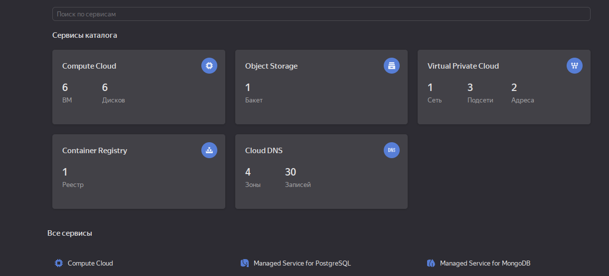
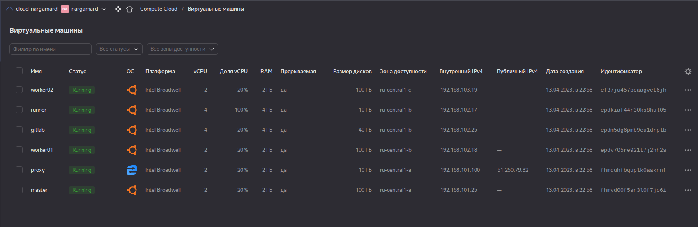
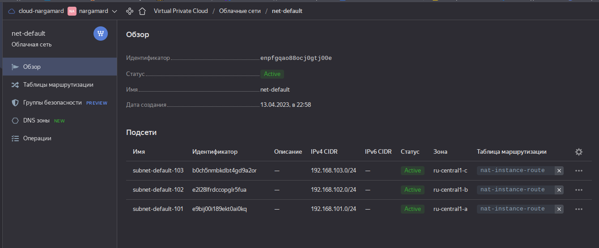
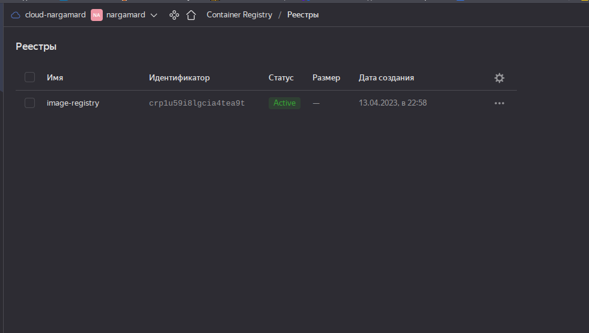
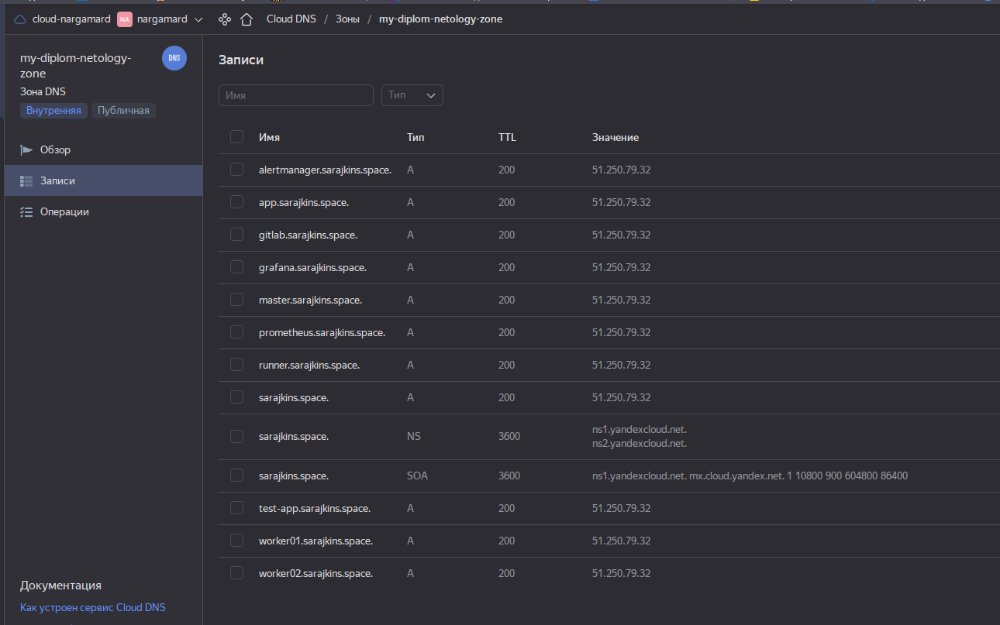

</details>


---

## ЭТАП II 
## Настройка Прокси

На этом этапе запускается `роль install-proxy`, которая на ноду `proxy` устанавливает пакет `haproxy` и копирует файл конфигруации, подготовленный автоматически по шаблону на предыдущем этапе.
И перезапускает сервис.

Настройка обеспечивает прослушивание порта 80 и перенаправление для ACL grafana.sarajkins.space, ACL app.sarajkins.space и test-app.sarajkins.space на ноду `master` порт 30080, ACL gitlab.sarajkins.space на ноду `gitlab`.
Также Haproxy обеспечивает доступ к нодe `master` через 6443 для доступа к кластеру `Kubernetes` и доступ ssh к нодам `master` и `runner`.

Шаблон конфигурации `Haproxy` выглядит так:

<details>
<summary>Шаблон конфигурации Haproxy</summary>

```bash
global
        log /dev/log    local0
        log /dev/log    local1 notice
        chroot /var/lib/haproxy
        stats socket /run/haproxy/admin.sock mode 660 level admin expose-fd listeners
        stats timeout 30s
        user haproxy
        group haproxy
        daemon

        # Default SSL material locations
        ca-base /etc/ssl/certs
        crt-base /etc/ssl/private

        # Default ciphers to use on SSL-enabled listening sockets.
        # For more information, see ciphers(1SSL). This list is from:
        #  https://hynek.me/articles/hardening-your-web-servers-ssl-ciphers/
        # An alternative list with additional directives can be obtained from
        #  https://mozilla.github.io/server-side-tls/ssl-config-generator/?server=haproxy
        ssl-default-bind-ciphers ECDH+AESGCM:DH+AESGCM:ECDH+AES256:DH+AES256:ECDH+AES128:DH+AES:RSA+AESGCM:RSA+AES:!aNULL:!MD5:!DSS
        ssl-default-bind-options no-sslv3

defaults
        log     global
        mode    http
        option  httplog
        option  dontlognull
        timeout connect 5000
        timeout client  50000
        timeout server  50000
        errorfile 400 /etc/haproxy/errors/400.http
        errorfile 403 /etc/haproxy/errors/403.http
        errorfile 408 /etc/haproxy/errors/408.http
        errorfile 500 /etc/haproxy/errors/500.http
        errorfile 502 /etc/haproxy/errors/502.http
        errorfile 503 /etc/haproxy/errors/503.http
        errorfile 504 /etc/haproxy/errors/504.http

frontend srv-http
    bind *:80
    mode http
    acl ACL_GRAFANA hdr(host) -i  grafana.sarajkins.space
    acl ACL_GITLAB hdr(host) -i  gitlab.sarajkins.space
    acl ACL_APP hdr(host) -i  app.sarajkins.space    
    acl ACL_TEST_APP  hdr(host) -i  test-app.sarajkins.space       
    use_backend http-back-grafana if ACL_GRAFANA
    use_backend http-back-gitlab if ACL_GITLAB
    use_backend http-back-app if ACL_APP    
    use_backend http-back-test-app if ACL_TEST_APP  

backend http-back-grafana
    mode http
    server master $internal_ip_address_master_yandex_cloud:30080

backend http-back-gitlab
    mode http
    server gitlab $internal_ip_address_gitlab_yandex_cloud:80

backend http-back-app
    mode http
    server app $internal_ip_address_master_yandex_cloud:30080

backend http-back-test-app
    mode http
    server test-app $internal_ip_address_master_yandex_cloud:30080

frontend srv-ssh-master
    bind *:2222
    mode tcp
    default_backend ssh-back-master

backend ssh-back-master
    mode tcp
    server master-ssh $internal_ip_address_master_yandex_cloud:22

frontend srv-ssh-runner
    bind *:2223
    mode tcp
    default_backend ssh-back-runner

backend ssh-back-runner
    mode tcp
    server runner-ssh $internal_ip_address_runner_yandex_cloud:22

frontend srv-kuber
    bind *:6443
    mode tcp       
    default_backend kuber-back-master

backend kuber-back-master
    mode tcp
    server master-kuber $internal_ip_address_master_yandex_cloud:6443
```
</details>

Доступ `Ansible` к другим нодам осуществляется с помощью команды вида `ansible_ssh_common_args='-o UserKnownHostsFile=/dev/null -o StrictHostKeyChecking=no -o ProxyCommand="ssh -W %h:%p -q ubuntu@master.sarajkins.space -o StrictHostKeyChecking=no "'`, которая для каждого узла содержится в файле `hosts`.

---
## ЭТАП III 
## Установка кластера Kubernetes

Кластер устанавливается на ноды `master`, `worker01` и `worker02`. 
В файле `hosts` добавлены группировки:
Группа `workers` включает в себя обе ноды `worker*`;
Группа `kluster` включает в себя группы `workers` и `master`;

Установка происходит в следующем порядке:
1. Против группы `kluster` запускается роль `install-kuber`, которая устанавливает пакеты Kubernetes на все ноды. После чего отдельно устанавливается `containerd` из репозитория с `docker.com`, удаляется файл `/etc/containerd/config.toml` и перезапускается служба.
Без этого кластер инициализировать нельзя.
2. Против группы `master` запускается роль `init-control-plane`, которая
   - Инициализиирует кластер
   - Копирует `.kube` в домашнюю директорию
   - Устанавливает сетевой плагин `flannel`
   - Выводит команду для подключения рабочих нод.
3. Против группы `workers` запускается роль `init-workers`, которая:
   - Получает команду для подключения к кластеру из перменной `join_command_raw`, к которой можно обратить через hostvars группы `kluster`;
   - Подключает ноды к кластеру при помощи этой команды.
   
---
## ЭТАП IV 
## Установка мониторинга
Против группы `master` запускается роль `install-kluster`, которая:
1. Устанавливет стек мониторинга в `namespace "monitoring"` при помощи `helm`
2. Устанавливает `ingress-nginx` при помощи `helm`.
3. Устанавливает `ingress` для `grafana` чтобы обеспечить доступ к сервису.
4. Создаёт `namespace` `stage` и `prod`.

Вывод команды kubectl get pods --all-namespaces:
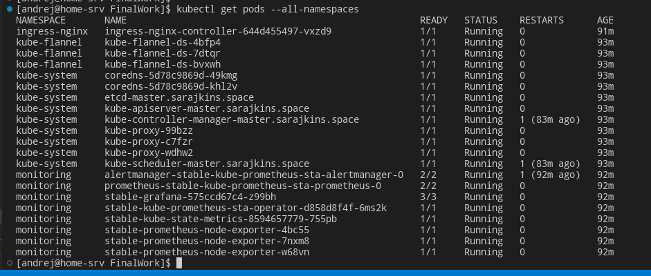

---
## ЭТАП V 
## Установка GitLab
Запускается роль `install-gitlab`, которая устанавливает `gitlab` на одноименную ноду. Прокси для доступа к веб-интерфейсу настроен ранее.

GitLab доступен по адресу gitlab.sarajkins.space:


---
## ЭТАП VI 
## Установка runner
Запускается роль `install-runner`, которая устанавливает `runner` на одноименную ноду.
Запускается роль `reconfig-runner`, которая устанавливает устанавливает на ноду`runner` `docker` и `kubectl`.

## ЭТАП VII 
## Деплой приложения
В папке `application` есть каталог `html`, который содержит сайт.
Также создан `Dockerfile`, который на основе образа `altcloud/nginx` позволяет собрать контейнер nginx с приложением.
Также в папке `application` на предыдущих этапах по шаблонам созданы файлы:
 - `.gitlab-ci.yml`
 - `ingress-myapp-prod.yaml`
 - `ingress-myapp-stage.yaml`
 - `service-prod.yaml`
 - `service-stage.yaml`
 - `deployment-prod.yaml`
 - `deployment-stage.yaml`

Прежде, чем приступить к работе с GitLab, добавим права для доступа к реестру в ЯО.

Приступаем к работе с GitLab:
1. Заходим на http://gitlab.sarajkins.space/;
2. Вводим логин и пароль, создаём новый проект;
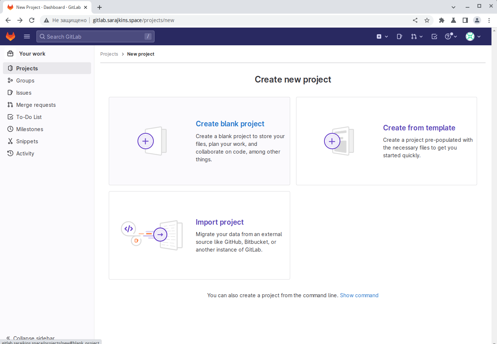
3. Вводим название проекта, например, `myapp`, нажимаем `Create project`;
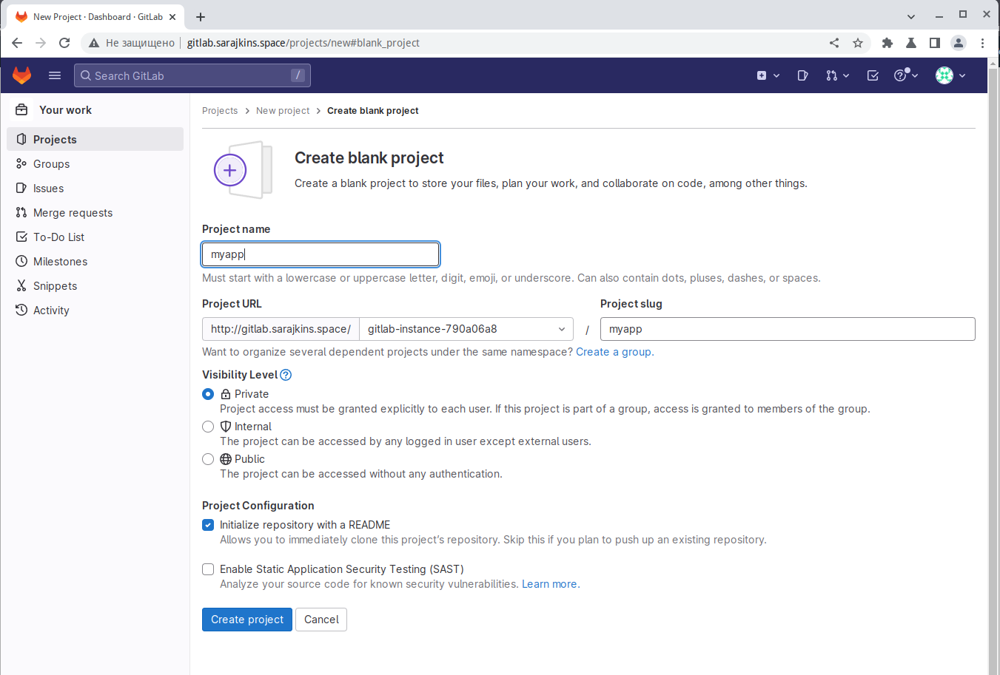
4. Проект создан. Заходим в репозиторий проекта и копируем ссылку для клонирования:
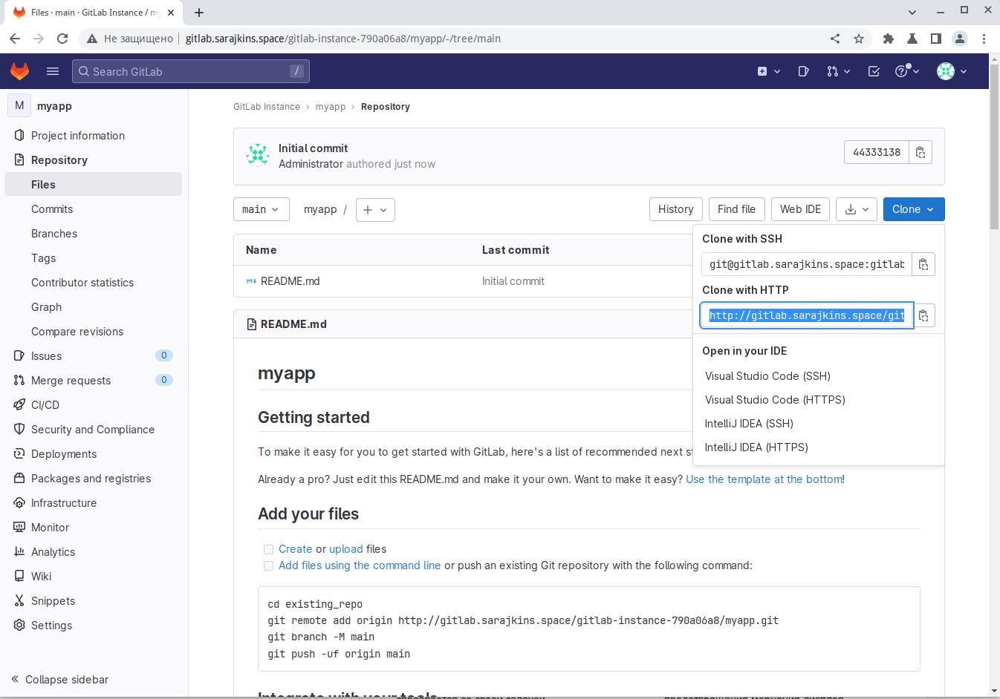
5. Клонируем репозиторий на локальную машину, копируем в него всё из папки `applications`, которая содержит приложение, конфигурационные файлы для деплоя и настройку CI:
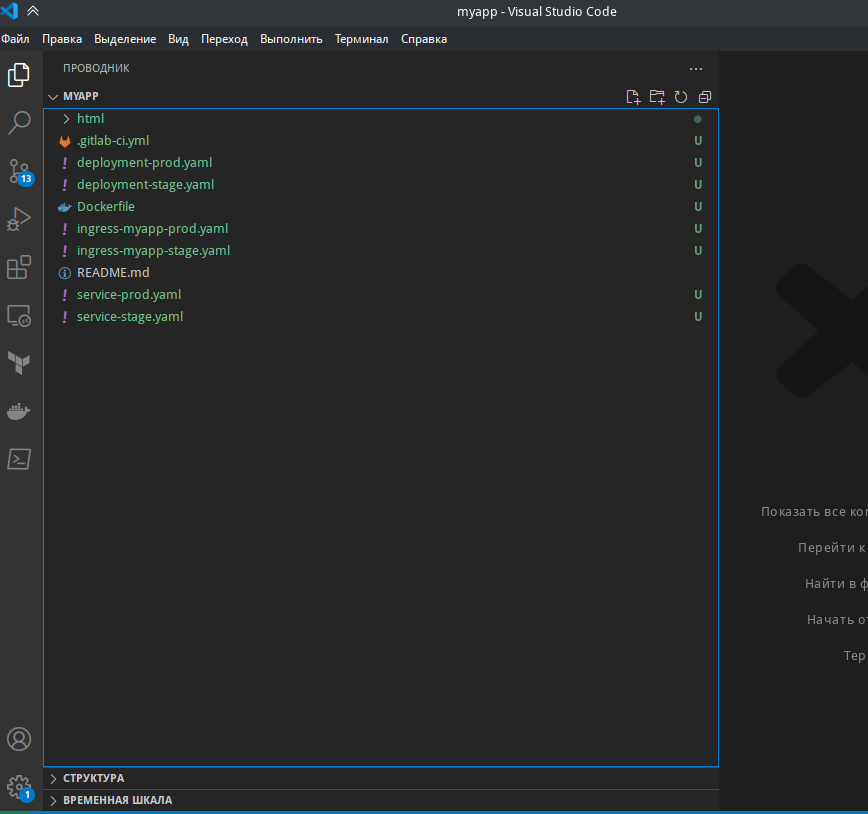

`.gitlab-ci.yml` содержит три `stages`: build, push, deploy
В зависимости от наличия тега, происходит сборка и загрузка в репозиторий образа либо с тем тегом, который был у коммита, либо со значением хэша коммита, если тега нет.
Далее, в зависимости от наличия тега, происходит деплой приложения в кластер в только `namespace` `stage` если тега нет, либо и в `prod` тоже, если тег есть.

<details>
<summary>.gitlab-ci.yml</summary>

```yaml
stages:
  - build
  - push
  - deploy

stagebuild:
  stage: build
  image: cr.yandex/yc/metadata-token-docker-helper:0.2
  services:
    - docker:19.03.1-dind
  script:
    - docker build . -t cr.yandex/crpch3mt0h1d5ntpbn6b/myapp:gitlab-$CI_COMMIT_SHORT_SHA

prodbuild:
  stage: build
  image: cr.yandex/yc/metadata-token-docker-helper:0.2
  services:
    - docker:19.03.1-dind
  script:
    - docker build . -t cr.yandex/crpch3mt0h1d5ntpbn6b/myapp:$CI_COMMIT_TAG
  only:
    - tags    

stagepush:
  stage: push
  image: cr.yandex/yc/metadata-token-docker-helper:0.2
  services:
    - docker:19.03.1-dind
  script:
    - docker push cr.yandex/crpch3mt0h1d5ntpbn6b/myapp:gitlab-$CI_COMMIT_SHORT_SHA

prodpush:
  stage: push
  image: cr.yandex/yc/metadata-token-docker-helper:0.2
  services:
    - docker:19.03.1-dind
  script:
    - docker push cr.yandex/crpch3mt0h1d5ntpbn6b/myapp:$CI_COMMIT_TAG
  only:
    - tags    

stagedeploy:
  stage: deploy
  script:
    - sed -i "s/__VERSION__/gitlab-$CI_COMMIT_SHORT_SHA/" deployment-stage.yaml
    - kubectl apply -f deployment-stage.yaml
    - kubectl apply -f service-stage.yaml
    - kubectl apply -f ingress-myapp-stage.yaml

proddeploy:
  stage: deploy
  script:
    - sed -i "s/__VERSION__/$CI_COMMIT_TAG/" deployment-prod.yaml
    - kubectl apply -f deployment-prod.yaml
    - kubectl apply -f service-prod.yaml
    - kubectl apply -f ingress-myapp-prod.yaml    
  only:
    - tags    

```
</details>

6. Фиксируем изменения и отправляем в репозиторий gitlab без тега:
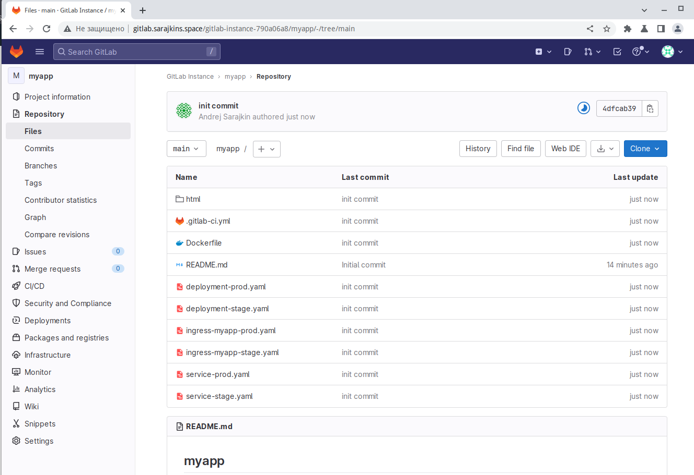
7. Сразу отработал `pipeline`, успешно выполнились все `stages`.
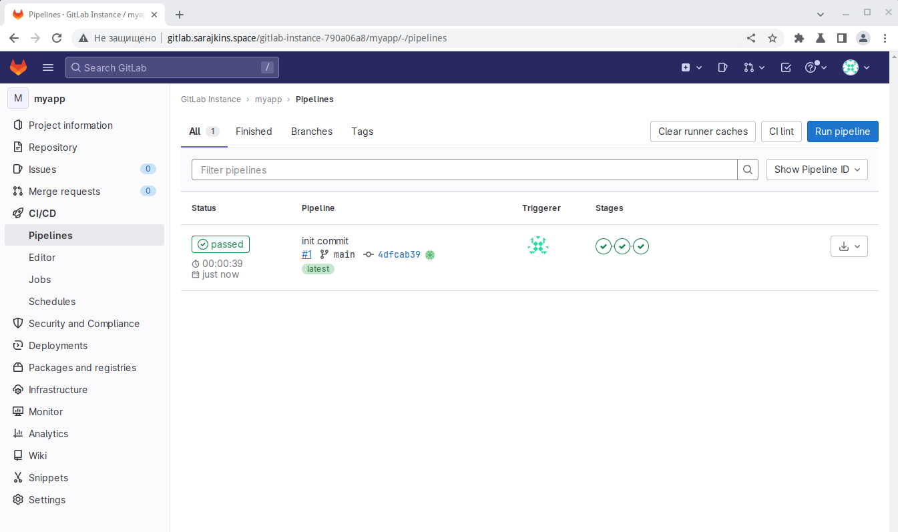
8. Проверяем тестовое приложение. Оно доступно по адресу http://test-app.sarajkins.space/

При этом не доступно приложение по адресу http://app.sarajkins.space/

9. Меняем текст на странице index.html и отправляем в репозиторий. Снова отработал pipeline, проверяем изменения:
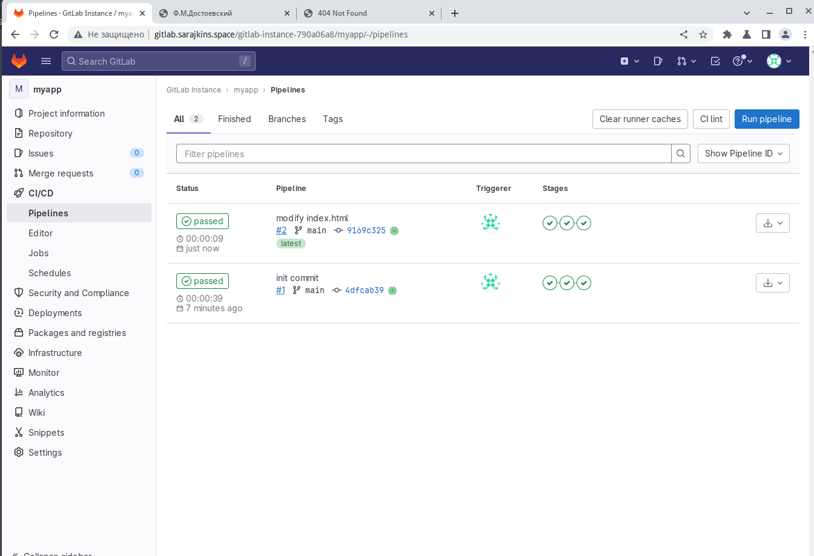
10. Снова отправляем изменения в репозиторий уже с тегом v.0.1 и проверяем доступность приложения по адресу http://app.sarajkins.space/:

Приложение доступно, а в реестре содержатся образы в числе и с тегом v.0.1:
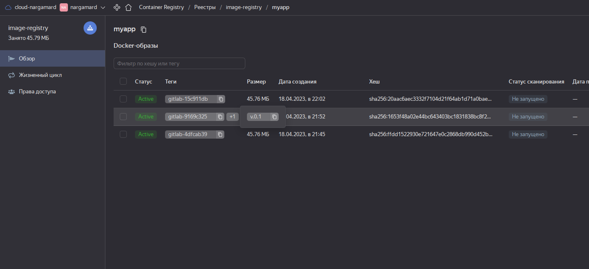
11. Проверяем работу системы мониторинга. `Grafana` доступна по адерсу http://grafana.sarajkins.space
12. Для примера посмотрим использование ресурсов сервисом `myapp` в `namespace` `prod`:
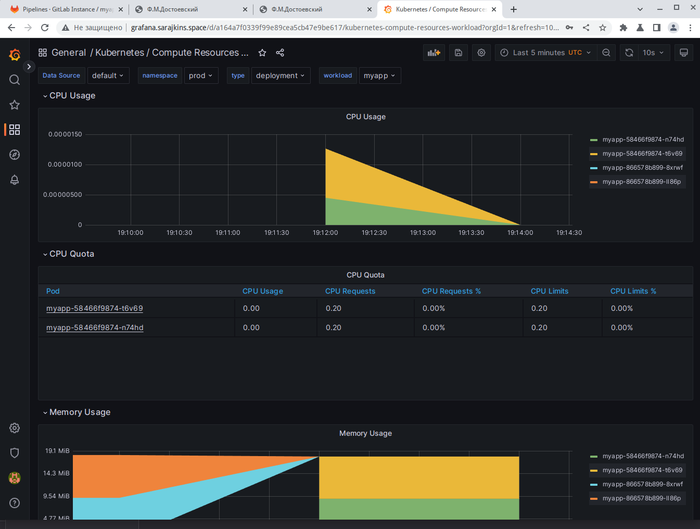

p.s.
А потом за пару минут в кластере для развлечения разворачиваем другое приложение. Например, эту игрушку:
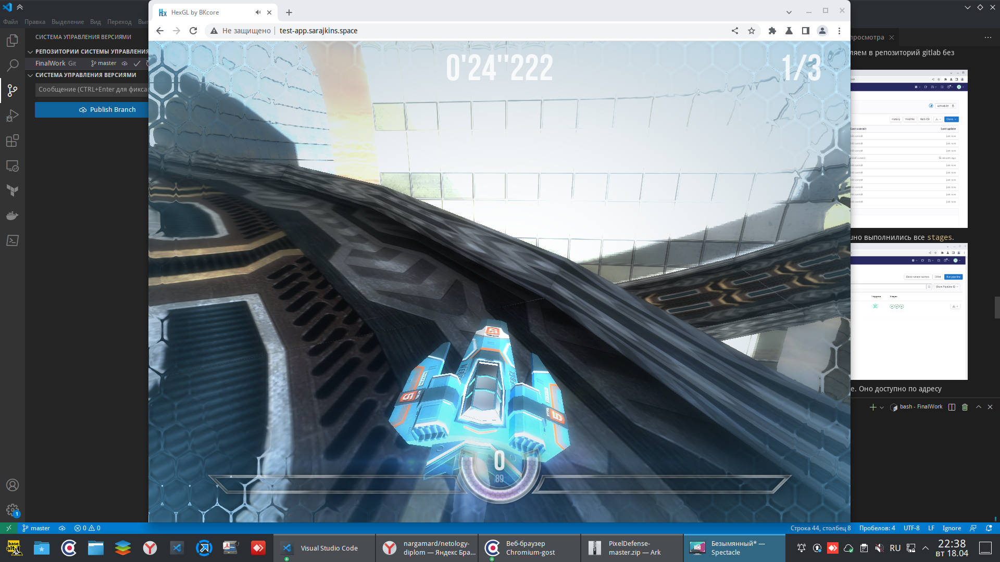